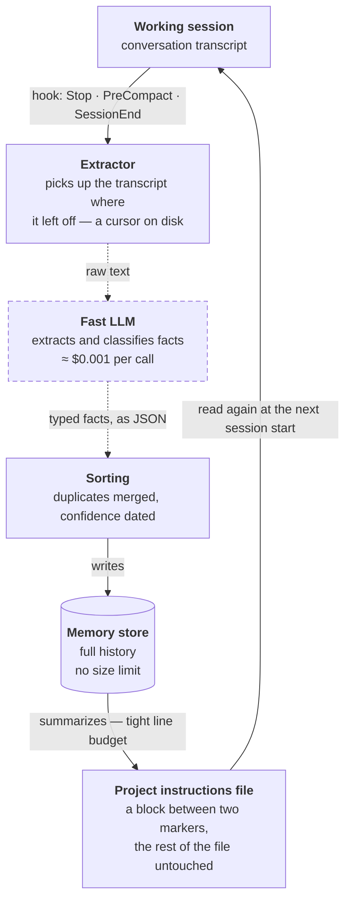
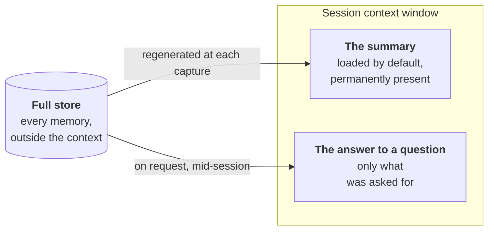

# Part I — Two Layers of Memory

> How a coding agent retains, from one session to the next, what it understood.
> No database, no cloud — just files.

Write to disk what must survive the end of a session, and make sure that file is read again
at the next startup. All the interest lies in the machinery that decides what to write,
where, and how much.

---

## The problem isn't memory, it's the end of the session

A coding agent understands an architecture after two hours of conversation, then the
session ends and it all goes. Next session, you explain again. Context gets rebuilt every
time, at the cost of tokens and patience.

Context compaction poses the same problem mid-session: when the window fills up, the start
of the conversation is summarized and set aside. What was learned early is precisely what
carried the most context.

The answer described here is one idea: **write to disk what must survive, and make sure
that file is read automatically at the next startup.** Nothing more exotic.

---

## The capture loop

It starts with a **hook**: an attachment point the agent fires at specific moments of its
lifecycle. Three moments matter — the end of a response, just before a context compaction,
and the end of the session. At each, an external program runs, reads what was just said,
and extracts what deserves keeping.



**Solid line = stays on the machine. Dashed line = leaves the machine.** Only one segment
goes out: the one asking a model to read the transcript. Everything else is reading and
writing files.

The loop closes by itself: the project instructions file is already read by the agent at
startup, without being asked. So it's enough to write into it. No injection mechanism to
invent — the system grafts onto behavior that already exists.

---

## Automatic capture, and what keeps it from overflowing

Naive capture quickly produces a dump: the same facts repeated every session, stale
information treated as fresh, an instructions file that swells until it eats the very
context it was meant to save. Four safeguards answer those four failures.

1. **A cursor, so only what's new gets read.** The position reached in the transcript is
   stored on disk. At the next trigger, only the lines added since are sent — the cost stays
   proportional to what was just said, not to the length of the conversation.

2. **Enforced typing.** The model doesn't return prose: it fills fixed categories. That
   constraint is what makes the final summary readable and groupable, instead of a pile of
   sentences.

3. **A similarity measure for duplicates.** Each extracted fact is compared to those already
   stored, by vocabulary overlap. Past a threshold, merge instead of append. Local
   computation, not a model call.

4. **Confidence decay by type.** A progress note goes stale in days; an architecture
   decision doesn't. Each memory carries a score that drops over time, at a rate depending
   on its category. Weak ones sink in the ranking, then leave the summary.

On top of that, periodic **consolidation**: past a certain number of memories, the model is
called back not to extract, but to reread the store, merge what overlaps, and mark what is
outdated. And the summary written into the instructions file lives under a fixed **line
budget**: most important first, the rest waits in the store.

### The six categories

Typing isn't decorative — it determines decay speed and the section where a fact will
appear.

| Category | Content | Decay |
|---|---|---|
| `architecture` | how the system is structured | none |
| `decision` | why this option rather than another | none |
| `pattern` | conventions: how things are done here | slow |
| `gotcha` | the non-obvious trap, the one that costs two hours | slow |
| `progress` | what's done, what's in flight | days |
| `context` | business context, deadlines, preferences | weeks |

`decision` is the most valuable category: code shows the choice, never the reason. And
`progress` must decay fast — a week-old status is a lie.

---

## Why two storage tiers rather than one

This is the decision that holds it all together. A single file read at startup can't grow
forever: every line occupies the context of *all* subsequent sessions, including those
where it's useless. But truncating memory to fit that budget means losing the history.

Hence the split: a **short summary, always loaded**, and a **full store that stays outside**
and answers only when queried.



The summary pays permanent rent in tokens, so it stays small. The store pays nothing until
queried, so it can keep everything. The two tiers don't store different things — the second
contains the first.

The practical consequence deserves saying: what isn't in the summary isn't forgotten, it's
simply *out of immediate reach*. The agent only knows it can search if it has been told —
in practice, a line at the end of the summary reminding it that search tools exist.

---

## Three ways to query the store

Storage is worth only what recall makes of it. The three modes don't overlap: they answer
three shapes of question.

| Mode | Typical question | Cost |
|---|---|---|
| **by keyword** | "What was said about authentication?" | local, free, instant |
| **by tag** | "Everything touching deployment" | local, free |
| **by question** | "How does billing work here?" | one model call |

The third is the only one that answers a question whose vocabulary you don't know: the best
matches are passed to a model that synthesizes an answer.

These three modes are exposed to the agent as tools it can call mid-conversation. That
requires an explicit declaration per project: capture hooks can be installed once for all,
but the ability to *query* memory is attached to the project. It's the easiest mismatch to
miss — capture runs everywhere, search only where it was wired in.

---

## The curated index, written by hand

Automatic capture has a structural flaw: it extracts what was *said*, with the fidelity of
a fast model working on a transcript. It produces volume, sometimes noise, and approximate
phrasing. For the few facts that must be exact — a working rule, a legal constraint, a line
never to cross — that isn't enough.

Hence a second layer, opposite in nature: **few files, deliberately written, one fact per
file.**

One folder per project. Inside, an index file and one Markdown file per fact, each with a
structured header: an identifier, a one-line description used to judge relevance at recall
time, and a type.

| Rule | Why |
|---|---|
| **The index never holds content** | one line per memory: title, link, hook. It's the only piece loaded every session — it must stay a table of contents, not a book |
| **One fact, one file** | the filename repeats the header identifier. A file holding two facts can no longer be corrected or deleted cleanly |
| **The why travels with the rule** | the reason, then the concrete expected action. A rule without its reason is misapplied the moment context shifts |
| **Memories cite each other** | a link to a fact not yet written is useful: it marks what remains to record |
| **Absolute dates** | "last week" means nothing in three months |

One negative rule does as much for quality as all the others: **don't record what the
repository already tells you.** Code structure, commit history, past fixes are read at the
source, and a copy in memory only ages badly. Memory is for what is written nowhere else —
the reasons, the refusals, the trade-offs, the traps.

Ready-made templates: [`templates/MEMORY-INDEX.md`](templates/MEMORY-INDEX.md) and
[`templates/memory-fact.md`](templates/memory-fact.md).

---

## They aren't redundant, they're complementary

|  | Automatic capture | Curated index |
|---|---|---|
| **written by** | a hook, unattended | the agent, on explicit confirmation |
| **volume** | hundreds of facts | a few dozen at most |
| **reliability** | correct on average, approximate in detail | exact, because reread |
| **strength** | losing nothing from a session you thought unimportant | keeping a rule intact for a year |
| **weakness** | noise, drifting phrasing, decay to manage | holds only what you thought to put in it |
| **cost** | one model call per trigger | none |
| **leaves the machine** | yes — the transcript goes out to be summarized | no |

The first is a safety net; the second is doctrine. Using both means accepting that
completeness and exactness aren't obtained by the same means.

---

## What it looks like on disk

No database, no service to run. JSON and Markdown, versioned or ignored as you choose.

```
<project>/
├── CLAUDE.md              ← auto summary, inside a delimited block
├── .memory/
│   ├── state.json         ← the full store
│   └── cursor.json        ← how far the transcript has been read
└── .mcp.json              ← declares the search tools for this project

~/<agent config>/
├── settings.json          ← the three capture hooks
└── projects/<project>/memory/
    ├── MEMORY.md          ← the curated index, one line per fact
    ├── working-rule.md    ← one fact per file, typed header
    └── migration-trap.md
```

The delimited block inside the instructions file is a detail that matters: the rest of the
file — the hand-written instructions — is never rewritten by the machine. Both coexist in
the same file without stepping on each other.

---

## What it costs

Three trade-offs, only one of them financial.

> ### ⚠ The trade-off that matters
>
> To summarize a session you have to read it — and it's a remote model doing the reading.
> **The transcript leaves the machine.** On a project under confidentiality, under
> regulatory constraint, or holding health or identity data, this layer must not be
> enabled. The curated index never leaves the disk: that's the layer to keep in that case.
>
> "Local memory" describes where memories are *stored*, not the trip taken to produce them.

**The monetary cost is small but continuous.** One call to a small model per trigger, a
fraction of a cent each. The trap isn't the unit price: it's the frequency, over a dense
working day with a hook at every end of response.

**And memory needs maintenance.** A false fact is worse than a missing one: it is reread
with confidence every session, and it steers decisions. Automatic capture cushions this
through decay and consolidation; the curated index requires it by hand — reread, correct,
delete what has stopped being true. Memory never purged becomes a stable source of errors.

---

## Implementation

The automatic capture layer described here corresponds to the free
[memory-mcp](https://github.com/yuvalsuede/memory-mcp) project (MIT licensed), published on
npm. This repository is neither its author nor affiliated with it.

The curated index layer needs nothing: it's the file-based memory mechanism built into
Claude Code. Only the writing discipline — index separate from content, one fact per file,
the why with the rule — is a choice.

To set everything up in one conversation, see [`getting-started.md`](getting-started.md).

---

[← Index](../README.md) · [Part II — Before the Code, After the Code →](02-method.md)
