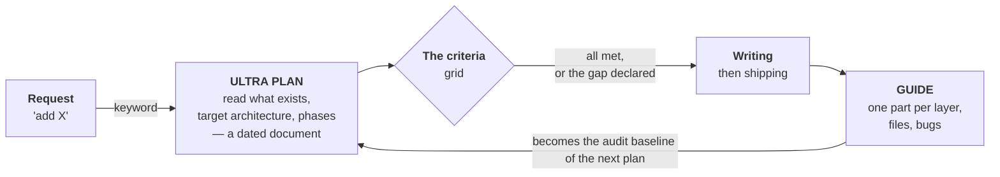

# Part II — Before the Code, After the Code

> Two documents, at two precise moments of a project. The first forbids writing code too
> early. The second forbids forgetting what was written.

---

## An agent that hasn't read the repo produces plausible code

Ask for a feature with no further detail: within seconds you'll get code that compiles,
looks right, and ignores half the project's conventions. It will survive the sprint. It
will break by the quarter.

The problem isn't the model's competence, it's the order of operations. An agent starts
writing as soon as it believes it has understood, and it believes that very fast. What's
missing isn't intelligence, it's a **sequence constraint**: read what exists, situate the
new code inside an architecture, and only then propose.

The second problem arrives later. A feature shipped across four layers — database, service,
API, interface — can no longer be reconstructed from memory three months on. Not by you,
not by the agent, which will start from scratch and reinvent what already exists.

Hence two documents, at two opposite moments of the cycle: **the ULTRA PLAN before**, the
**GUIDE after**. They don't resemble each other and don't serve the same purpose.

---

## The cycle, and the barrier in the middle

The two documents aren't two report formats: they occupy two different positions in the
chain. **The barrier at the center is what separates a method from a mere habit of
documenting.** A criterion that can't be met is declared; it isn't worked around.

The loop is the part noticed last: the guide written after a feature becomes the raw
material for the next plan's audit. After a few cycles, "what already exists?" has a
written answer instead of a reconstruction.

---

## Two words that change the working mode

The protocol is triggered by a keyword placed in the request: **`ULTRA PLAN`**. Nothing
else to do — no command, no tool, no configuration file.

Why a word rather than an instruction repeated every time? Because the instruction is
*written once* into the agent's persistent memory, as an entry that says: here's the
trigger, here's the procedure, here's why. The agent rereads it every session. The keyword
is only the handle; the machinery is in the memory.

This is why **the method doesn't hold without the memory layer** described in
[Part I](01-memory.md). A protocol re-explained every session ends up re-explained wrong,
then not at all.

In practice, the keyword flips the agent into **plan mode**: it may no longer modify a
file. It reads, it proposes, and you approve before a single line is written. The refusal
to execute is what gives the protocol its force — without it, the plan becomes a commentary
produced while the code is already on its way.

> Executable version: the [`skills/ultra-plan`](skills/ultra-plan/SKILL.md) skill.

---

## Sincerity is a technical constraint

A plan is made in a certain state of mind, and that state of mind matters more than the
template. An agent is tuned to answer fast and to please — two reflexes that produce
exactly the plan you don't want.

### Think, don't produce

The first coherent plan that comes to mind is almost never the right one: it's the most
obvious, the one that repeats the request as phrased without questioning it. A serious plan
requires **weighing the option you don't like**, looking for what would break the chosen
approach, going to see the neighboring module that already does something similar.

That takes thinking time, and that time must be granted explicitly — an agent not invited
to take it will optimize for response speed. That's the protocol's trade-off: a plan takes
minutes, not seconds. **If the answer arrives instantly, it wasn't thought through.**

### Zero flattery

The failure mode specific to this working relationship isn't technical error, it's
**automatic agreement**. The agent validates the idea because it came from you. It finds
the plan excellent. It mentions the risk in one line, then builds everything else as if the
risk didn't exist.

The rule is simple and it outranks the comfort of the exchange: **if the request is a bad
idea, the plan says so — first, clearly** — then delivers the complete plan anyway under
stated assumptions. The decision to override belongs to whoever is leading, not to the
agent. But it must be made knowingly.

Three answers are legitimate and must be given when true: *"I don't know"*, *"that won't
work"*, *"that isn't verifiable as things stand"*. An explanation invented to please always
costs more than the admission it replaces.

| What betrays a flattering plan | What to write instead |
|---|---|
| "it should work" | what was tried, with the observed result — or the admission that nothing was |
| "you just need to" | the files touched, one by one |
| "excellent idea" | what the idea costs, and the condition it depends on |
| "as the architecture intends" | the line of code that actually does it |
| "quick to do" | the breakdown into phases, or nothing |

### Verified before writing, verifiable afterwards

Every piece of information in a plan was verified at the moment of writing. Not assumed
from a filename, not inferred from a comment, not lifted from documentation never checked
against the code. What is asserted was read, run, or counted.

And that's only half the requirement. **Verified** means the author checked; **verifiable**
means the reader can redo the check without trusting the author. Both are required. A claim
that is true but unverifiable forces belief on someone's word — and an agent's word is
precisely what the protocol doesn't want to have to believe.

In practice, this splits everything a plan can write into **three registers that never
mix**:

- **The finding** — established, with its proof beside it: a `file:line` reference, a real
  count, a command that returns nothing. Verifiable in thirty seconds by someone else.
- **The hypothesis** — marked as such, never slipped in among the findings, accompanied by
  *what would settle it*. An unflagged hypothesis becomes a false fact at the next audit.
- **The decision** — dated and attributed. It doesn't need proving, it was made — but one
  must be able to find when, and by whom.

A plan that mixes the three registers is more dangerous than no plan at all: six months
later it will be read as a reliable baseline, hypotheses included.

---

## Read what exists, and let it win

Before any proposal, three readings, in this order:

1. **The file tree** — the module concerned, as it is. Not guessed, not extrapolated from a
   folder name.
2. **The architecture in place** — the layers and their permitted dependencies. Answer this:
   where does the new code fit *without breaking the existing separation*?
3. **The module's conventions** — naming, dependency injection, error handling, shape of
   transfer objects. Every module has its own, and they're written nowhere but in the code.

The rule that makes all the difference fits in one sentence: **when an existing convention
conflicts with the agent's first idea, the convention wins.** An agent will happily produce
more elegant code than yours, in a style that isn't yours — and you inherit two dialects in
one repository. Consistency is worth more than local elegance.

---

## The criteria grid is built, not copied

At the center of the protocol sits a short list of criteria a plan must satisfy before
becoming code. It is what turns an intention into a barrier: without a grid, "make a good
plan" means nothing and blocks nothing.

But that list isn't taken from someone else. A criterion you never paid for won't be
defended the day it costs a week of work: it will be ticked, which is exactly the opposite
of the point. **A borrowed grid produces polite plans with no barrier.**

It is derived from one place only — what has already hurt on this project, or what would
hurt in a specific way. A single question commands it:

> ### What makes a project like mine fail, three months after shipping?

### Deriving your grid, once

1. **List the failures, not the virtues.** What actually broke — on this project or the
   last: the production incident, the migration that ate two days, the bug a user found
   before you did. Dated facts, not lessons.

2. **Group by cause, not by symptom.** Three failures that look different but all come from
   missing logs make one criterion. This is the step that turns twenty regrets into a
   workable grid.

3. **Translate each group into a verifiable question.** Not a virtue name, a question whose
   answer is demonstrated in the plan: *if this breaks at three in the morning, what tells
   me where?* — *what happens if this call fails halfway?* — *who can read this data without
   being entitled to?*

4. **Cut to five or ten.** Keep the expensive ones. What falls out isn't lost: if it breaks
   again, it will climb back up the list on its own.

5. **Write the grid where the agent will reread it,** with the reason for each criterion
   beside it. A criterion without its reason is misapplied the moment context shifts — and
   nobody will know why it's there in six months.

### What the answer gives on different ground

The question is the same everywhere, the answer never is. A few examples, to be read as
illustrations of the method — **not as a catalogue to shop from**:

| Ground | What surfaces |
|---|---|
| **Data processing** | reproducibility — same input, same output, months later; provenance tracking; cost per batch |
| **Mobile app** | offline behavior, binary size, compatibility with OS versions still in circulation, battery draw |
| **Regulated domain** | audit trail, retention period, reversibility of an automated decision, ability to explain an output — these precede all others |
| **Team work** | interface backward compatibility, branch conventions, what must be reviewed before merging — a solo developer has none of the three |
| **Production service** | behavior under load, errors handled at the boundaries, authorization checked before data access, logs that locate a failure |
| **Deliberately throwaway prototype** | half the criteria above drop, and another appears: the date you throw it away. Without it, the prototype becomes production by accident |

### Three rules for a grid that holds

**Few.** Five to ten. Beyond that you stop verifying them and start ticking them.

**Phrased as a verifiable question, not as a virtue.** "Observable" means nothing until
translated. The interrogative form can be checked; the virtue name can only be signed.

**Born of real pain.** And when something breaks for a reason no criterion covered, that's
one more criterion: **the grid is a record of scars, not a list of good intentions.** It
grows slowly, and it is sound because it was paid for.

### Two safeguards, whatever the grid

**A criterion that can't be met is declared in the plan.** An inherited constraint sometimes
forces a workaround: it is stated, with its reason, at the place where it sits. A plan that
ticks every box out of politeness is worth nothing — the value is in the admission.

**And the criteria apply to the plan's scope, not beyond.** Without that limit, security and
testability requirements become a license to rework five neighboring modules and add tests
everywhere. The bar is the *durable minimum viable*: what holds for months in real
conditions. Not gold plating.

---

## The baseline is proven, not narrated

The most useful part of a plan isn't the target architecture — it's the audit of what
exists that precedes it. And an audit is worth only its proofs: every finding carries the
measurement that establishes it.

| Finding | Proof |
|---|---|
| The collector targets local addresses, inoperative once deployed | `file:line` |
| The table meant to receive those metrics is empty in production | `0 rows` |
| The "notify by email" field is read nowhere | `grep → 0 hits` |
| The dashboard counts subscription rows, not people | `216 rows / 48 humans` |

The table above is a template: what matters is the form. On the left a claim that commits,
on the right what lets anyone check it in thirty seconds — a file and line reference, a real
count in the database, a search that returns nothing.

This discipline answers a specific failing of agents: they readily describe what the code
*should* do based on its name, its comments, or its documentation. **Measurement always
beats documentation.** A service called `AlertService` that has never sent an alert is a
dead service, whatever its name.

The audit closes on two lists worth more than a long diagnosis: **what is dead or lying**,
and **what is reusable**. The second avoids rewriting what already works — that's the one
that saves days.

---

## Anatomy of the plan document

A dated Markdown file, stored with the project. Seven sections, in this order.

| Section | Content |
|---|---|
| **Vision** | how we'll know it worked, in one checkable sentence. Not "improve tracking" but an observable state you can confirm or not |
| **Baseline, dated** | what's dead or lying, what's reusable. Every line with its proof. The date matters: an audit goes stale |
| **Target architecture** | per layer. Where the new code fits, which files are touched, what gets deleted |
| **The criteria** | how each is met in this specific plan — and which isn't, with its reason |
| **Phase breakdown** | deliverables, not tasks. A phase ends with something that works and can be seen |
| **Approved decisions** | dated, attributed. "We're dropping this module" is findable six months later, with the day it was settled |
| **What was shipped** | added to *the same document* afterwards, not to a new file |

That last section is the one most easily forgotten and the one that makes the document
durable: a plan never updated becomes a dated lie, which a future audit will take for
reality.

Template: [`templates/plan.md`](templates/plan.md).

---

## The guide, written once it works

The guide answers a question the plan can't address: **how does it actually work, end to
end, now that it's built?** It's written after shipping, when the feature crosses every
layer and its detours are finally known.

Its structure follows the path of a piece of data through the system — one part per layer
crossed — then four sections that never appear in ordinary documentation:

| Section | Why it matters |
|---|---|
| **One part per layer** | from entry point to storage, in flow order, with the interface contracts between each layer — that's where errors lodge |
| **The data schema** | tables, columns, types, constraints. What the code assumes of the database, in black and white |
| **The file inventory** | every file created or modified, with its role in one line. The most useful and most thankless section: it lets you find an entry point without digging |
| **Bugs found and fixed** | what broke during construction and why. A trap database that reads in five minutes and saves hours — the section nobody else writes |
| **What remains** | accepted debt, untreated cases. The starting point of the next plan |

A guide is long — several hundred to over a thousand lines for a complete system — and
that's normal: it replaces a code review by someone who wasn't there. It's dated in its
filename, because two successive guides on the same system tell its evolution.

> **The difference not to miss.** A guide isn't a plan written in the past tense. The plan
> was a **commitment**: it was discussed, refused, approved. The guide is a **record**: it
> describes what is, including what went wrong.
>
> A guide that mentions no bugs wasn't written after construction — it was written instead
> of it.

Template: [`templates/guide.md`](templates/guide.md) · Executable version:
[`skills/delivery-guide`](skills/delivery-guide/SKILL.md).

---

## Three things to write once

There's nothing to install. The method comes down to three pieces of writing, after which
it maintains itself.

1. **The protocol, in memory.** A persistent entry saying: this keyword triggers this mode;
   here is the reading sequence; here are *your* criteria — derived from your project, not
   copied from here; here's why. Without it, the keyword means nothing next session.
2. **A folder for plans.** Stored with the project, one dated file per plan. The filing
   matters little; the date in the name does.
3. **A folder for guides.** Same rule. The guide of a shipped feature stays there, and it's
   what the agent will reread when that area is touched again.

The real cost is elsewhere: it's the reading time before coding, and the discipline of not
letting through a plan that dodges a criterion. The gain shows up on the second or third
cycle, when an audit is done by rereading a guide instead of reconstructing a system from
memory.

One last remark, true of any method of this kind: **it only means something if someone
refuses the plans that don't hold.** A protocol without veto power is just formatting.

---

[← Part I — Two Layers of Memory](01-memory.md) · [Index](../README.md)
