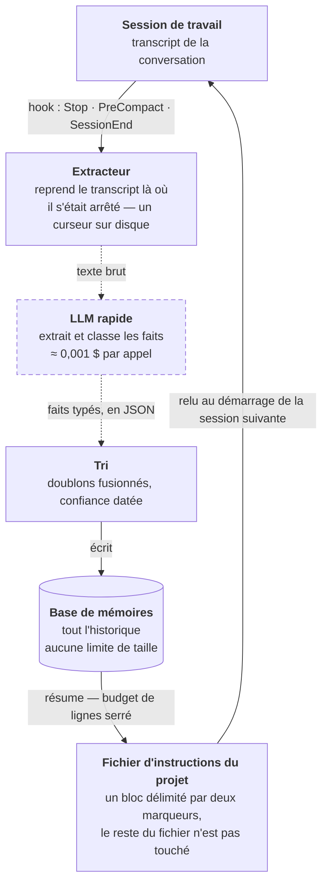
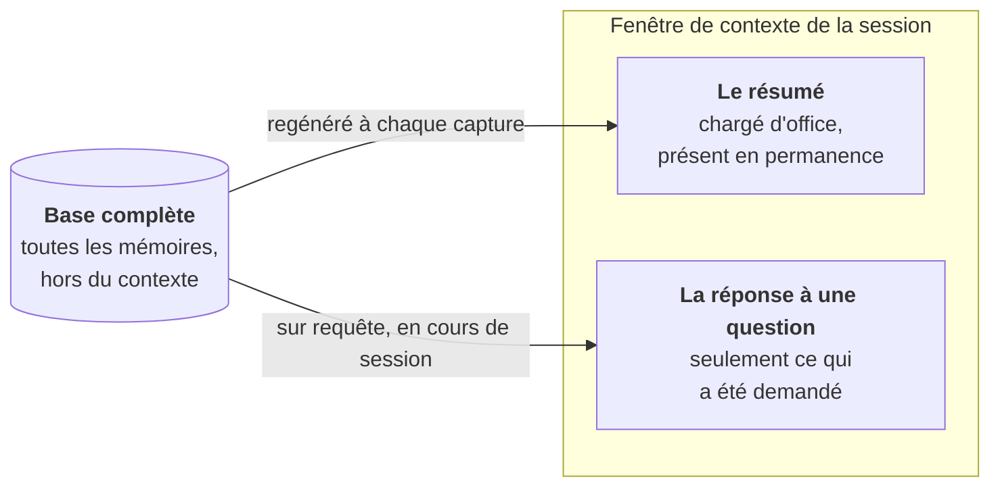

# Partie I — Deux couches de mémoire

> Comment un agent de code retient, d'une session à l'autre, ce qu'il a compris.
> Sans base de données, sans cloud, avec des fichiers.

Écrire sur le disque ce qui doit survivre à la fin d'une session, et faire en sorte que ce
fichier soit relu au démarrage suivant. Tout l'intérêt est dans la mécanique qui décide
quoi écrire, où, et combien.

---

## Le problème n'est pas la mémoire, c'est la fin de session

Un agent de code comprend une architecture en deux heures de conversation, puis la session
se termine et tout part. À la session suivante, on réexplique. Le contexte se reconstruit à
chaque fois, au prix de tokens et de patience.

La compaction du contexte pose le même problème en plein milieu d'une session : quand la
fenêtre se remplit, le début de la conversation est résumé puis écarté. Ce qui a été appris
tôt est justement ce qui portait le plus de contexte.

La réponse décrite ici tient en une idée : **écrire sur le disque ce qui doit survivre, et
faire en sorte que ce fichier soit relu automatiquement au démarrage suivant.** Rien de
plus exotique.

---

## La boucle de capture

Tout part d'un **hook** : un point d'accroche que l'agent déclenche à des moments précis de
son cycle de vie. Trois moments comptent — la fin d'une réponse, juste avant une compaction
de contexte, et la fin de session. À chacun, un programme externe est lancé, lit ce qui
vient de se dire, et en tire ce qui mérite d'être gardé.



**Trait plein = reste sur la machine. Trait pointillé = quitte la machine.** Un seul
segment sort : celui qui demande à un modèle de lire le transcript. Tout le reste est de la
lecture-écriture de fichiers.

La boucle se referme d'elle-même : le fichier d'instructions du projet est déjà lu par
l'agent au démarrage, sans qu'on le lui demande. Il suffit donc d'y écrire. Aucun mécanisme
d'injection à inventer — le système se greffe sur un comportement qui existe.

---

## La capture automatique, et ce qui l'empêche de déborder

Une capture naïve produit vite un dépotoir : les mêmes faits répétés à chaque session, des
informations périmées traitées comme neuves, un fichier d'instructions qui gonfle jusqu'à
manger le contexte qu'il était censé économiser. Quatre garde-fous répondent à ces quatre
dérives.

1. **Un curseur, pour ne relire que le neuf.** La position atteinte dans le transcript est
   stockée sur disque. Au déclenchement suivant, seules les lignes ajoutées depuis sont
   envoyées — le coût reste proportionnel à ce qui vient de se dire, pas à la longueur de
   la conversation.

2. **Un typage imposé.** Le modèle ne renvoie pas de la prose : il remplit des catégories
   fixes. Cette contrainte est ce qui rend le résumé final lisible et regroupable, au lieu
   d'un tas de phrases.

3. **Une mesure de similarité pour les doublons.** Chaque fait extrait est comparé à ceux
   déjà stockés par recouvrement de vocabulaire. Au-delà d'un seuil, on fusionne au lieu
   d'ajouter. C'est du calcul local, pas un appel au modèle.

4. **Une décroissance de confiance selon le type.** Un état d'avancement se périme en
   quelques jours ; une décision d'architecture, non. Chaque mémoire porte un score qui
   baisse avec le temps, à une vitesse qui dépend de sa catégorie. Les faibles descendent
   dans le classement, puis sortent du résumé.

À cela s'ajoute une **consolidation** périodique : passé un certain nombre de mémoires, le
modèle est rappelé non pour extraire, mais pour relire le stock, fusionner ce qui se
recoupe et marquer ce qui est dépassé. Et le résumé écrit dans le fichier d'instructions
vit sous un **budget de lignes** fixe : le plus important d'abord, le reste attend dans la
base.

### Les six catégories

Le typage n'est pas décoratif — c'est lui qui détermine la vitesse de péremption et la
section où le fait apparaîtra.

| Catégorie | Contenu | Péremption |
|---|---|---|
| `architecture` | Comment le système est structuré | aucune |
| `decision` | Pourquoi telle option plutôt qu'une autre | aucune |
| `pattern` | Les conventions : comment on fait ici | longue durée |
| `gotcha` | Le piège non évident, celui qui coûte deux heures | longue durée |
| `progress` | Ce qui est fait, ce qui est en cours | quelques jours |
| `context` | Contexte métier, échéances, préférences | quelques semaines |

`decision` est la catégorie la plus précieuse : le code montre le choix, jamais la raison.
Et `progress` doit se périmer vite — un état d'avancement vieux d'une semaine est un
mensonge.

---

## Pourquoi deux niveaux de stockage plutôt qu'un

C'est la décision qui fait tenir l'ensemble. Un seul fichier lu au démarrage ne peut pas
grossir indéfiniment : chaque ligne occupe le contexte de *toutes* les sessions suivantes,
y compris celles où elle ne sert à rien. Mais tronquer la mémoire pour tenir dans ce
budget, c'est perdre l'historique.

D'où la séparation : un **résumé court, toujours chargé**, et une **base complète qui reste
dehors** et ne répond que si on l'interroge.



Le résumé paie un loyer permanent en tokens, donc il reste petit. La base ne paie rien tant
qu'on ne l'interroge pas, donc elle peut tout garder. Les deux niveaux ne stockent pas des
choses différentes — le second contient le premier.

La conséquence pratique mérite d'être dite : ce qui n'est pas dans le résumé n'est pas
oublié, il est simplement *hors de portée immédiate*. L'agent ne sait qu'il peut le
chercher que si on le lui a dit — en pratique, une ligne à la fin du résumé qui rappelle
que des outils de recherche existent.

---

## Trois façons d'interroger la base

Le stockage ne vaut que par le rappel. Les trois modes ne se recouvrent pas : ils répondent
à trois formes de question.

| Mode | Question type | Coût |
|---|---|---|
| **par mot-clé** | « Qu'est-ce qui a été dit sur l'authentification ? » | local, gratuit, instantané |
| **par étiquette** | « Tout ce qui touche au déploiement » | local, gratuit |
| **par question** | « Comment marche la facturation ici ? » | un appel de modèle |

Le troisième est le seul qui répond à une question dont on ne connaît pas le vocabulaire :
les meilleures correspondances sont passées à un modèle qui en synthétise une réponse.

Ces trois modes sont exposés à l'agent comme des outils qu'il peut appeler lui-même en
cours de conversation. Cela suppose une déclaration explicite par projet : les hooks de
capture peuvent être installés une fois pour toutes, mais la possibilité d'*interroger* la
mémoire est attachée au projet. C'est le décalage le plus facile à manquer — la capture
tourne partout, la recherche seulement là où elle a été branchée.

---

## L'index curé, écrit à la main

La capture automatique a un défaut structurel : elle extrait ce qui a été *dit*, avec la
fidélité d'un modèle rapide travaillant sur un transcript. Elle produit du volume, parfois
du bruit, et des formulations approximatives. Pour les quelques faits qui doivent être
exacts — une règle de travail, une contrainte légale, une limite à ne jamais franchir —
cela ne suffit pas.

D'où une seconde couche, de nature opposée : **peu de fichiers, écrits délibérément, un
fait par fichier.**

Un dossier par projet. Dedans, un fichier d'index et un fichier Markdown par fait, chacun
avec un en-tête structuré : un identifiant, une description d'une ligne qui sert à juger de
la pertinence au moment du rappel, et un type.

| Règle | Pourquoi |
|---|---|
| **L'index ne contient jamais de contenu** | une ligne par mémoire : titre, lien, accroche. C'est la seule pièce chargée à chaque session — elle doit rester un sommaire, pas un livre |
| **Un fait, un fichier** | le nom du fichier reprend l'identifiant de l'en-tête. Un fichier qui contient deux faits ne peut plus être ni corrigé ni supprimé proprement |
| **Le pourquoi accompagne la règle** | la raison, puis l'action concrète attendue. Une règle sans sa raison est appliquée de travers dès que le contexte bouge |
| **Les mémoires se citent entre elles** | un lien vers un fait pas encore écrit est utile : il marque ce qui reste à consigner |
| **Dates absolues** | « la semaine dernière » ne veut plus rien dire dans trois mois |

Une règle négative fait autant pour la qualité que toutes les autres : **ne pas consigner
ce que le dépôt raconte déjà.** La structure du code, l'historique des commits, les
correctifs passés se lisent à la source, et une copie dans la mémoire ne fait que vieillir
mal. La mémoire sert à ce qui n'est écrit nulle part — les raisons, les refus, les
arbitrages, les pièges.

Gabarits prêts à l'emploi : [`gabarits/INDEX-MEMOIRE.md`](gabarits/INDEX-MEMOIRE.md) et
[`gabarits/memoire-fait.md`](gabarits/memoire-fait.md).

---

## Elles ne sont pas redondantes, elles sont complémentaires

|  | Capture automatique | Index curé |
|---|---|---|
| **écrit par** | un hook, sans intervention | l'agent, sur confirmation explicite |
| **volume** | des centaines de faits | quelques dizaines, au plus |
| **fiabilité** | correcte en moyenne, approximative au détail | exacte, parce que relue |
| **point fort** | ne rien perdre d'une session qu'on croyait sans importance | faire survivre une règle intacte pendant un an |
| **point faible** | bruit, formulations qui dérivent, péremption à gérer | ne contient que ce qu'on a pensé à y mettre |
| **coût** | un appel de modèle par déclenchement | nul |
| **sort du poste** | oui — le transcript part se faire résumer | non |

La première est un filet ; la seconde est une doctrine. Utiliser les deux, c'est accepter
que l'exhaustivité et l'exactitude ne s'obtiennent pas par le même moyen.

---

## Ce que ça donne sur le disque

Aucune base de données, aucun service à faire tourner. Du JSON et du Markdown,
versionnables ou ignorés au choix.

```
<projet>/
├── CLAUDE.md              ← résumé auto, dans un bloc délimité
├── .memory/
│   ├── state.json         ← la base complète
│   └── cursor.json        ← où en est la lecture du transcript
└── .mcp.json              ← déclare les outils de recherche pour ce projet

~/<config de l'agent>/
├── settings.json          ← les trois hooks de capture
└── projects/<projet>/memory/
    ├── MEMORY.md          ← l'index curé, une ligne par fait
    ├── regle-de-travail.md ← un fait par fichier, en-tête typé
    └── piege-migration.md
```

Le bloc délimité dans le fichier d'instructions est un détail qui compte : le reste du
fichier — les consignes écrites à la main — n'est jamais réécrit par la machine. Les deux
cohabitent dans le même fichier sans se marcher dessus.

---

## Ce que ça coûte

Trois contreparties, dont une seule est financière.

> ### ⚠ La contrepartie qui compte
>
> Pour résumer une session, il faut la lire — et c'est un modèle distant qui lit. **Le
> transcript quitte la machine.** Sur un projet sous clause de confidentialité, sous
> contrainte réglementaire, ou contenant des données de santé ou d'identité, cette couche
> ne doit pas être activée. L'index curé, lui, ne sort jamais du disque : c'est la couche à
> garder dans ce cas.
>
> « Mémoire locale » décrit où les mémoires sont *stockées*, pas le trajet fait pour les
> produire.

**Le coût monétaire est faible mais continu.** Un appel à un petit modèle par
déclenchement, quelques fractions de centime chacun. Le piège n'est pas le prix unitaire :
c'est la fréquence, sur une journée de travail dense avec un hook à chaque fin de réponse.

**Et la mémoire demande de l'entretien.** Un fait faux est pire qu'un fait absent : il est
relu avec confiance à chaque session, et il oriente des décisions. La capture automatique
amortit cela par la péremption et la consolidation ; l'index curé le demande à la main —
relire, corriger, supprimer ce qui a cessé d'être vrai. Une mémoire jamais purgée devient
une source d'erreurs stable.

---

## Mise en œuvre

La couche de capture automatique décrite ici correspond au projet libre
[memory-mcp](https://github.com/yuvalsuede/memory-mcp) (licence MIT), publié sur npm. Ce
dépôt n'en est pas l'auteur et n'y est pas affilié.

La couche d'index curé n'a besoin de rien : c'est le mécanisme de mémoire fichier intégré à
Claude Code. Seule la discipline d'écriture — index séparé du contenu, un fait par fichier,
le pourquoi avec la règle — relève d'un choix.

Pour tout installer en une conversation, voir [`demarrage.md`](demarrage.md).

---

[← Sommaire](../README.fr.md) · [Partie II — Avant le code, après le code →](02-methode.md)
