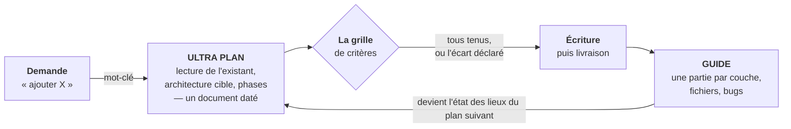

# Partie II — Avant le code, après le code

> Deux documents, à deux moments précis d'un projet. Le premier interdit d'écrire du code
> trop tôt. Le second interdit d'oublier ce qui a été écrit.

---

## Un agent qui n'a pas lu le dépôt produit du code plausible

Demandez une fonctionnalité sans autre précision : vous obtiendrez, en quelques secondes,
du code qui compile, qui a l'air juste, et qui ignore la moitié des conventions du projet.
Il passera le sprint. Il cassera au trimestre.

Le problème n'est pas la compétence du modèle, c'est l'ordre des opérations. Un agent
commence à écrire dès qu'il croit avoir compris, et il croit avoir compris très vite. Ce
qui manque n'est pas de l'intelligence, c'est une **contrainte de séquence** : lire
l'existant, situer le nouveau code dans une architecture, puis seulement proposer.

Le second problème arrive plus tard. Une fonctionnalité livrée sur quatre couches — base de
données, service, API, interface — n'est plus reconstituable de mémoire trois mois après.
Ni par vous, ni par l'agent, qui repartira de zéro et réinventera ce qui existe déjà.

D'où deux documents, à deux moments opposés du cycle : **l'ULTRA PLAN avant**, le **GUIDE
après**. Ils ne se ressemblent pas et ne servent pas à la même chose.

---

## Le cycle, et la barrière au milieu

Les deux documents ne sont pas deux formats de compte rendu : ils occupent deux positions
différentes dans la chaîne. **La barrière au centre est ce qui distingue la méthode d'une
simple habitude de documenter.** Un critère non tenu se dit ; il ne se contourne pas.

La boucle est la partie qu'on remarque le plus tard : le guide écrit après une
fonctionnalité devient la matière première de l'audit du plan suivant. Au bout de quelques
cycles, la question « qu'est-ce qui existe déjà ? » a une réponse écrite au lieu d'une
reconstitution.

---

## Deux mots qui changent le mode de travail

Le protocole s'active par un mot-clé posé dans la demande : **`ULTRA PLAN`**. Rien d'autre
à faire — pas de commande, pas d'outil, pas de fichier de configuration.

Pourquoi un mot plutôt qu'une consigne répétée à chaque fois ? Parce que la consigne est
*écrite une fois* dans la mémoire persistante de l'agent, sous la forme d'une entrée qui
dit : voilà le déclencheur, voilà la procédure, voilà pourquoi. L'agent la relit à chaque
session. Le mot-clé n'est que la poignée ; la mécanique est dans la mémoire.

C'est la raison pour laquelle **la méthode ne tient pas sans la couche mémoire** décrite en
[partie I](01-memoire.md). Un protocole réexpliqué à chaque session finit par être
réexpliqué de travers, puis plus du tout.

En pratique, le mot-clé fait basculer l'agent en **mode plan** : il n'a plus le droit de
modifier de fichier. Il lit, il propose, et vous validez avant qu'une ligne soit écrite. Le
refus d'exécution est ce qui donne sa force au protocole — sans lui, le plan devient un
commentaire produit pendant que le code part déjà.

> Version exécutable : le skill [`skills/ultra-plan`](skills/ultra-plan/SKILL.md).

---

## La sincérité est une contrainte technique

Un plan se fabrique dans un certain état d'esprit, et cet état d'esprit compte plus que le
gabarit. Un agent est réglé pour répondre vite et pour plaire — deux réflexes qui
produisent exactement le plan qu'il ne faut pas.

### Réfléchir, pas produire

Le premier plan cohérent qui vient à l'esprit n'est presque jamais le bon : c'est le plus
évident, celui qui reprend la demande telle qu'elle a été formulée sans l'interroger. Un
plan sérieux demande de **peser l'option qu'on n'aime pas**, de chercher ce qui casserait
l'approche retenue, d'aller voir le module voisin qui fait déjà quelque chose de similaire.

Cela prend du temps de réflexion, et ce temps doit être accordé explicitement — un agent
qui n'y est pas invité optimisera la vitesse de réponse. C'est la contrepartie du
protocole : un plan demandé prend des minutes, pas des secondes. **Si la réponse arrive
instantanément, elle n'a pas été réfléchie.**

### Zéro complaisance

Le mode de défaillance propre à cette relation de travail n'est pas l'erreur technique,
c'est l'**accord automatique**. L'agent valide l'idée parce qu'elle vient de vous. Il
trouve le plan excellent. Il mentionne le risque en une ligne, puis construit tout le reste
comme si le risque n'existait pas.

La règle est simple et elle prime sur le confort de l'échange : **si la demande est une
mauvaise idée, le plan le dit — d'abord, clairement**, puis livre quand même le plan
complet sous hypothèses annoncées. La décision de passer outre appartient à celui qui
dirige, pas à l'agent. Mais elle doit être prise en connaissance de cause.

Trois réponses ont droit de cité et doivent être données quand elles sont vraies : *« je ne
sais pas »*, *« ça ne marchera pas »*, *« ce n'est pas vérifiable en l'état »*. Une
explication inventée pour faire plaisir coûte toujours plus cher que l'aveu qu'elle
remplace.

| Ce qui trahit un plan complaisant | Ce qu'il faut écrire à la place |
|---|---|
| « ça devrait fonctionner » | ce qui a été essayé, avec le résultat observé — ou l'aveu que rien ne l'a été |
| « il suffit de » | les fichiers touchés, un par un |
| « excellente idée » | ce que l'idée coûte, et la condition à laquelle elle tient |
| « comme prévu par l'architecture » | la ligne de code qui le fait réellement |
| « rapide à faire » | le découpage en phases, ou rien |

### Vérifié avant d'être écrit, vérifiable après

Toute information inscrite dans un plan a été vérifiée au moment de l'écrire. Pas supposée
d'après un nom de fichier, pas déduite d'un commentaire, pas reprise d'une documentation
qu'on n'a pas confrontée au code. Ce qui est affirmé a été lu, exécuté ou compté.

Et ce n'est que la moitié de l'exigence. **Vérifié** veut dire que l'auteur a contrôlé ;
**vérifiable** veut dire que le lecteur peut refaire le contrôle sans faire confiance à
l'auteur. Les deux sont requis. Une affirmation juste mais invérifiable oblige à croire sur
parole — et la parole d'un agent est précisément ce que le protocole ne veut pas avoir à
croire.

En pratique, cela découpe tout ce qu'un plan peut écrire en **trois registres, qui ne se
mélangent jamais** :

- **Le constat** — établi, avec sa preuve à côté : une référence fichier et ligne, un
  compte réel, une commande qui ne renvoie rien. Vérifiable en trente secondes par
  quelqu'un d'autre.
- **L'hypothèse** — marquée comme telle, jamais glissée au milieu des constats,
  accompagnée de *ce qui permettrait de la trancher*. Une hypothèse non signalée devient un
  fait faux au prochain audit.
- **La décision** — datée et attribuée. Elle n'a pas à être prouvée, elle a été prise —
  mais on doit pouvoir retrouver quand, et par qui.

Un plan qui mélange les trois registres est plus dangereux qu'un plan absent : il sera relu
six mois plus tard comme un état des lieux fiable, hypothèses comprises.

---

## Lire l'existant, et lui donner raison

Avant toute proposition, trois lectures, dans cet ordre :

1. **L'arborescence** — le module concerné, tel qu'il est. Pas deviné, pas extrapolé d'un
   nom de dossier.
2. **L'architecture en place** — les couches et leurs dépendances autorisées. La question à
   laquelle il faut répondre : où ce nouveau code s'insère-t-il *sans casser la séparation
   existante* ?
3. **Les conventions du module** — nommage, injection de dépendances, gestion d'erreur,
   forme des objets de transfert. Chaque module a les siennes, et elles ne sont écrites
   nulle part sauf dans le code.

La règle qui fait toute la différence tient en une phrase : **quand la convention existante
s'oppose à la première idée de l'agent, c'est la convention qui gagne.** Un agent produit
volontiers un code plus élégant que le vôtre, dans un style qui n'est pas le vôtre — et
vous héritez de deux dialectes dans le même dépôt. La cohérence vaut plus que l'élégance
locale.

---

## La grille de critères se construit, elle ne se copie pas

Au centre du protocole il y a une liste courte de critères qu'un plan doit satisfaire avant
de devenir du code. C'est elle qui transforme une intention en barrière : sans grille,
« fais un bon plan » ne veut rien dire et ne bloque rien.

Mais cette liste ne se reprend pas chez quelqu'un d'autre. Un critère qu'on n'a jamais payé
ne sera pas défendu le jour où il coûte une semaine de travail : il sera coché, ce qui est
exactement l'inverse du but. **Une grille empruntée produit des plans polis et sans
barrière.**

Elle se dérive d'un seul endroit — ce qui a déjà fait mal sur le projet, ou ce qui ferait
mal de façon précise. Une seule question la commande :

> ### Qu'est-ce qui fait échouer un projet comme le mien, trois mois après la livraison ?

### Dériver sa grille, une fois

1. **Lister les pannes, pas les vertus.** Ce qui a réellement cassé — sur ce projet ou le
   précédent : l'incident en production, la migration qui a mangé deux jours, le bug trouvé
   par un utilisateur avant vous. Des faits datés, pas des leçons.

2. **Regrouper par cause, pas par symptôme.** Trois pannes d'apparence différente qui
   viennent toutes de l'absence de journaux ne font qu'un seul critère. C'est l'étape qui
   fait passer d'une liste de vingt regrets à une grille tenable.

3. **Traduire chaque groupe en question vérifiable.** Pas un nom de vertu, une question
   dont la réponse se démontre dans le plan : *si ça casse à trois heures du matin,
   qu'est-ce qui me permet de savoir où ?* — *que se passe-t-il si cet appel échoue à
   mi-parcours ?* — *qui peut lire cette donnée sans y avoir droit ?*

4. **Couper à cinq ou dix.** Garder les plus chers. Ce qui tombe n'est pas perdu : si ça
   recasse, ça remontera tout seul dans la liste.

5. **Écrire la grille là où l'agent la relira,** avec la raison de chaque critère à côté. Un
   critère sans sa raison est appliqué de travers dès que le contexte bouge — et personne ne
   saura pourquoi il est là dans six mois.

### Ce que la réponse donne selon le terrain

La question est la même partout, la réponse jamais. Quelques exemples, à lire comme des
illustrations de la démarche — **pas comme un catalogue dans lequel se servir** :

| Terrain | Ce qui remonte |
|---|---|
| **Traitement de données** | reproductibilité — même entrée, même sortie, des mois plus tard ; traçabilité de la provenance ; coût d'exécution par lot |
| **Application mobile** | comportement hors ligne, poids du binaire, compatibilité avec les versions d'OS encore en circulation, consommation d'énergie |
| **Domaine réglementé** | piste d'audit, durée de conservation, réversibilité d'une décision automatique, capacité à expliquer une sortie — ceux-là précèdent tous les autres |
| **Travail à plusieurs** | rétrocompatibilité des interfaces, conventions de branche, ce qui doit être relu avant d'être fusionné — un développeur seul n'a aucun des trois |
| **Service en production** | tenue en charge, erreurs traitées aux frontières, autorisation vérifiée avant l'accès aux données, journaux permettant de situer une panne |
| **Prototype assumé jetable** | la moitié des critères précédents saute, et un autre apparaît : la date à laquelle on jette. Sans elle, le prototype devient la production par accident |

### Trois règles pour que la grille tienne

**Peu nombreux.** Cinq à dix. Au-delà, on ne les vérifie plus : on les coche.

**Formulés comme une question vérifiable, pas comme une vertu.** « Observable » ne veut
rien dire tant qu'on ne l'a pas traduit. La forme interrogative se vérifie ; le nom de
vertu se signe.

**Nés d'une douleur réelle.** Et quand quelque chose casse pour une raison qu'aucun critère
ne couvrait, c'est un critère de plus : **la grille est un relevé de cicatrices, pas une
liste de bonnes intentions.** Elle grandit lentement, et elle est juste parce qu'elle a été
payée.

### Deux garde-fous, quelle que soit la grille

**Un critère qui ne peut pas être tenu se déclare dans le plan.** Une contrainte héritée
impose parfois un contournement : il se dit, avec sa raison, à l'endroit où il se trouve.
Un plan qui coche toutes les cases par politesse ne vaut rien — la valeur est dans l'aveu.

**Et les critères s'appliquent dans le périmètre du plan, pas au-delà.** Sans cette limite,
les exigences de sécurité et de testabilité deviennent un permis de refondre cinq modules
voisins et d'ajouter des tests partout. La barre visée est le *minimum viable durable* : ce
qui tient des mois en conditions réelles. Pas de la dorure.

---

## L'état des lieux se prouve, il ne se raconte pas

La partie la plus utile d'un plan n'est pas l'architecture cible — c'est l'audit de
l'existant qui la précède. Et un audit ne vaut que par ses preuves : chaque constat porte
la mesure qui l'établit.

| Constat | Preuve |
|---|---|
| Le collecteur vise des adresses locales, inopérantes une fois déployé | `fichier:ligne` |
| La table censée recevoir ces mesures est vide en production | `0 ligne` |
| Le champ « notifier par email » n'est lu nulle part | `grep → 0 occurrence` |
| Le tableau de bord compte des lignes d'abonnement, pas des personnes | `216 lignes / 48 humains` |

Le tableau ci-dessus est un gabarit : ce qui compte est la forme. À gauche une affirmation
qui engage, à droite ce qui permet de la vérifier en trente secondes — une référence
fichier et ligne, un compte réel en base, une recherche qui ne renvoie rien.

Cette discipline répond à un travers précis des agents : ils décrivent volontiers ce que le
code *devrait* faire d'après son nom, ses commentaires ou sa documentation. **La mesure
prime toujours la documentation.** Un service appelé `AlertService` qui n'a jamais envoyé
d'alerte est un service mort, quel que soit son nom.

L'audit se conclut sur deux listes qui valent mieux qu'un long diagnostic : **ce qui est
mort ou mensonger**, et **ce qui est réutilisable**. La seconde évite de réécrire ce qui
marche déjà — c'est elle qui fait gagner des journées.

---

## Anatomie du document de plan

Un fichier Markdown daté, rangé avec le projet. Sept sections, dans cet ordre.

| Section | Contenu |
|---|---|
| **Vision** | à quoi on saura que c'est réussi, en une phrase vérifiable. Pas « améliorer le suivi » mais un état observable qu'on pourra constater ou non |
| **État des lieux, daté** | ce qui est mort ou mensonger, ce qui est réutilisable. Chaque ligne avec sa preuve. La date compte : un audit se périme |
| **Architecture cible** | par couche. Où le nouveau code s'insère, quels fichiers sont touchés, ce qui est supprimé |
| **Les critères** | comment chacun est tenu dans ce plan précis — et lequel ne l'est pas, avec sa raison |
| **Découpage en phases** | des livrables, pas des tâches. Une phase se termine par quelque chose qui marche et qu'on peut voir |
| **Décisions validées** | datées, attribuées. « On abandonne ce module » se retrouve six mois plus tard, avec le jour où ça a été tranché |
| **Ce qui a été livré** | ajouté *au même document* après coup, pas dans un nouveau fichier |

Cette dernière section est celle qu'on oublie le plus facilement et qui rend le document
durable : un plan jamais mis à jour devient un mensonge daté, qu'un futur audit prendra
pour la réalité.

Gabarit : [`gabarits/plan.md`](gabarits/plan.md).

---

## Le guide, écrit une fois que ça marche

Le guide répond à une question que le plan ne traite pas : **comment ça fonctionne
réellement, de bout en bout, maintenant que c'est construit ?** Il s'écrit après la
livraison, quand la fonctionnalité traverse toutes les couches et qu'on en connaît enfin
les détours.

Sa structure suit le trajet d'une donnée à travers le système — une partie par couche
traversée — puis quatre sections qui ne figurent jamais dans une documentation ordinaire :

| Section | Pourquoi elle compte |
|---|---|
| **Une partie par couche** | du point d'entrée jusqu'au stockage, dans l'ordre du flux, avec les contrats d'interface entre chaque couche — c'est là que les erreurs se logent |
| **Le schéma de données** | tables, colonnes, types, contraintes. Ce que le code suppose de la base, écrit noir sur blanc |
| **L'inventaire des fichiers** | tous les fichiers créés ou modifiés, avec leur rôle en une ligne. La section la plus utile et la plus ingrate : elle permet de retrouver un point d'entrée sans fouiller |
| **Les bugs trouvés et corrigés** | ce qui a cassé pendant la construction et pourquoi. Une base de pièges qui se lit en cinq minutes et fait gagner des heures — la section que personne n'écrit ailleurs |
| **Ce qui reste** | les dettes assumées, les cas non traités. Le point de départ du plan suivant |

Un guide est long — de plusieurs centaines à plus de mille lignes pour un système complet —
et c'est normal : il remplace la relecture du code par un tiers qui n'était pas là. Il est
daté dans son nom de fichier, parce que deux guides successifs sur le même système
racontent son évolution.

> **La différence à ne pas manquer.** Un guide n'est pas un plan rédigé au passé. Le plan
> est un **engagement** : il se discute, se refuse, se valide. Le guide est un **relevé** :
> il décrit ce qui est, y compris ce qui a mal tourné.
>
> Un guide qui ne mentionne aucun bug n'a pas été écrit après la construction — il a été
> écrit à la place.

Gabarit : [`gabarits/guide.md`](gabarits/guide.md) · Version exécutable :
[`skills/guide-livraison`](skills/guide-livraison/SKILL.md).

---

## Trois choses à écrire une seule fois

Il n'y a rien à installer. La méthode tient en trois écritures, après quoi elle
s'auto-entretient.

1. **Le protocole, en mémoire.** Une entrée persistante qui dit : ce mot-clé déclenche ce
   mode ; voilà la séquence de lecture ; voilà *vos* critères — dérivés de votre projet,
   pas recopiés d'ici ; voilà pourquoi. Sans elle, le mot-clé ne veut rien dire à la
   session suivante.
2. **Un dossier pour les plans.** Rangé avec le projet, un fichier daté par plan. Le
   classement importe peu ; la date dans le nom, si.
3. **Un dossier pour les guides.** Même règle. Le guide d'une fonctionnalité livrée y
   reste, et c'est ce que l'agent relira quand on touchera à nouveau à cette zone.

Le coût réel est ailleurs : c'est le temps de lecture avant de coder, et la discipline de
ne pas laisser passer un plan qui esquive un critère. Le gain apparaît au deuxième ou
troisième cycle, quand un audit se fait en relisant un guide au lieu de reconstituer un
système de mémoire.

Une dernière remarque, qui vaut pour toute méthode de ce genre : **elle n'a de sens que si
quelqu'un refuse les plans qui ne tiennent pas.** Un protocole sans droit de veto n'est
qu'une mise en forme.

---

[← Partie I — Deux couches de mémoire](01-memoire.md) · [Sommaire](../README.fr.md)
